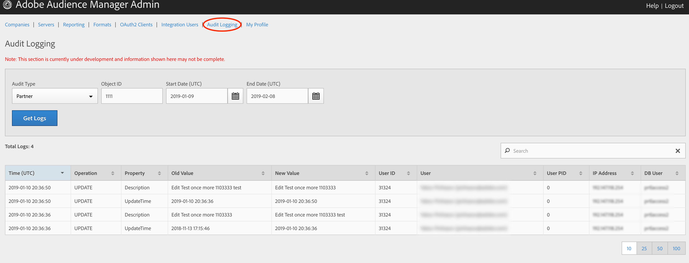

# 監査ログ {#audit-logging}

顧客の問題をデバッグする際は、最初の場所 [!UICONTROL  Audit Logging] として使用してください。

> [!NOTE]
>
>[!UICONTROL Audit Logging] は現在開発中で、変更の対象となっています。発生した問題（ [!DNL JIRA][!DNL UI] チーム）をログインしてください

「監査タイプ **」** ドロップダウンセレクターで、次のいずれかを選択します。

* [!UICONTROL Partner]
* [!UICONTROL User]
* [!UICONTROL Group]
* [!UICONTROL Datasource Summary]
* [!UICONTROL General Datasource]
* [!UICONTROL Merge Rule Datasource]
* [!UICONTROL Data Feed]
* [!UICONTROL Data Feed Subscription]
* [!UICONTROL Trait Summary]
* [!UICONTROL Trait Rule]
* [!UICONTROL Segment Summary]
* [!UICONTROL Destination Summary]
* [!UICONTROL Server to Server Destination]
* [!UICONTROL Derived Signal]
* [!UICONTROL Model]
* [!UICONTROL Segment Test Group]

**オブジェクトID** は、調査しているアイテムのIDです。次の表に、各ケースのオブジェクトIDに対応するIDを示します。

| 監査タイプ | オブジェクトID |
---------|----------|
| [!UICONTROL Partner] | パートナーID- PID |
| [!UICONTROL User] | ユーザー ID |
| [!UICONTROL Group] | B3 |
| [!UICONTROL Datasource Summary] | データソース ID |
| [!UICONTROL General Datasource] | データソース ID |
| [!UICONTROL Merge Rule Datasource] | データソース ID |
| [!UICONTROL Data Feed] | Data Feed ID |
| [!UICONTROL Data Feed Subscription] | Data Feed ID |
| [!UICONTROL Trait Summary] | SID（特性） |
| [!UICONTROL Trait Rule] | SID（特性） |
| [!UICONTROL Segment Summary] |  |
| [!UICONTROL Destination Summary] |  |
| [!UICONTROL Server-to-Server Destination] | なし |
| [!UICONTROL Derived Signal] | なし |
| [!UICONTROL Model] | なし |
| [!UICONTROL Segment Test Group] | なし |

ログの時間間隔を絞り込むには、（ [!UICONTROL Start Date][!DNL UTC]）および [!UICONTROL End Date] （[!DNL UTC]）を使用します。