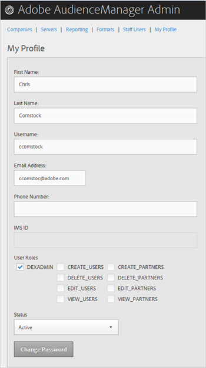
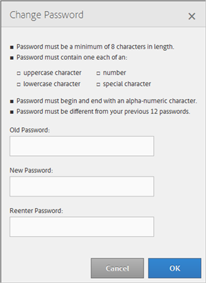

# マイプロファイル {#my-profile}

Audience Manager の Admin ツールプロファイルの詳細情報の編集や、パスワードの変更をおこないます。

<!-- c_my_profile.xml -->

## プロファイルの編集 {#edit-profile}

View and edit your Audience Manager Admin tool profile, including first and last name, username, email address, phone number, [!UICONTROL IMS ID], user roles, and status.

<!-- t_edit_profile.xml -->

1. 「**[!UICONTROL My Profile]**」をクリックします。

   

2. 以下のフィールドを設定します。
   * **[!UICONTROL First Name]:** （必須）名を指定します。
   * **[!UICONTROL Last Name]:** （必須）姓を指定します。
   * **[!UICONTROL Username]:** （必須）最初のユーザー名を指定します。
   * **[!UICONTROL Email Address]:** （必須）電子メールアドレスを指定します。
   * **[!UICONTROL Phone Number]:** 電話番号を指定します。
   * **[!UICONTROL IMS ID]:** インターネットメッセージサービスIDを指定します。
   * **[!UICONTROL User Roles]:** 目的のユーザーの役割を選択します。
      * **[!UICONTROL DEXADMIN]:** Audience Manager管理ツールでタスクを実行するための管理者アクセスを提供します。このオプションを選択しない場合、個別の役割を選択できます。These roles let users perform tasks using [!DNL API] calls, but not in the Admin tool.
      * **[!UICONTROL CREATE_USERS]:** ユーザーは [!DNL API] 、呼び出しを使用して新しいユーザーを作成できます。
      * **[!UICONTROL DELETE_USERS]:** ユーザーは [!DNL API] 、呼び出しを使用して既存のユーザーを削除できます。
      * **[!UICONTROL EDIT_USERS]:** ユーザーは [!DNL API] 呼び出しを使用して既存のユーザーを編集できます。
      * **[!UICONTROL VIEW_USERS]:** ユーザーは [!DNL API] 、呼び出しを使用してAudience Manager設定内の他のユーザーを表示できます。
      * **[!UICONTROL CREATE_PARTNERS]:** ユーザーは [!DNL API] 、呼び出しを使用してAudience Managerパートナーを作成できます。
      * **[!UICONTROL DELETE_PARTNERS]:** ユーザーは [!DNL API] 、呼び出しを使用してAudience Managerパートナーを削除できます。
      * **[!UICONTROL EDIT_PARTNERS]:** ユーザーは [!DNL API] 、呼び出しを使用してAudience Managerパートナーを編集できます。
      * **[!UICONTROL VIEW_PARNTERS]:** ユーザーは [!DNL API] 、呼び出しを使用してAudience Managerパートナーを表示できます。
   * **[!UICONTROL Status]:** 目的のステータスを選択します。
      * **[!UICONTROL Active]:** アクティブなAudience Managerユーザーのユーザーを指定します。
      * **[!UICONTROL Deactivated]:** このユーザーがAudience Managementの非アクティブ化されたユーザーであることを指定します。
      * **[!UICONTROL Expired]:** Audience Managerでこのユーザーのアカウントが有効期限切れになったことを示します。
      * **[!UICONTROL Locked Out]:** Audience Managerでこのユーザーのアカウントがロックされていることを示します。
3. 「**[!UICONTROL Submit]**」をクリックします。

## パスワードの変更 {#change-password}

Audience Manager の Admin ツールのパスワードを変更します。

<!-- t_change_password.xml -->

1. 「**[!UICONTROL My Profile]**」をクリックします。
1. 「**[!UICONTROL Change Password]**」をクリックします。

   

   Audience Manager のパスワードは次の条件を満たしている必要があります。

   * 8 文字以上である。、
   * 1つの大文字のリース時に含める
   * 最低1文字の小文字を含む;
   * 数字を少なくとも1つ含む;
   * 少なくとも1文字の特殊文字を含む
   * 英数字を使用して開始と終了
   * 英数字で始まります。

1. 元のパスワードを指定します。
1. 新しいパスワードを指定し、新しいパスワードをもう一度確認します。
1. 「**[!UICONTROL OK]**」をクリックします。