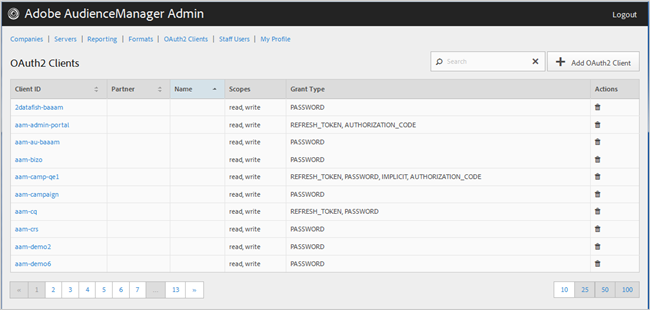

# OAuth2 クライアント {#oauth-clients}

[!UICONTROL OAuth2 Clients] ページを使用して、[!DNL Audience Manager] 構成内の [!UICONTROL OAuth2] クライアントのリストを表示します。所定のユーザーの役割があれば、既存のクライアントの編集や削除、新しいクライアントの作成ができます。

## 概要 {#overview}

<!-- c_oauth.xml -->

>[!NOTE]
>
>顧客に [!DNL Audience Manager ユーザーガイドの [OAuth2](https://docs.adobe.com/content/help/ja-JP/audience-manager/user-guide/api-and-sdk-code/rest-apis/aam-api-getting-started.html#oauth) ドキュメントを必ず読むよう指示してください。

[!DNL OAuth2] は、リソース所有者に代わって [!DNL Audience Manager] リソースへの安全な委任アクセスに使用する認証のオープン規格です。

目的の列のヘッダーをクリックすると、その列を昇順または降順に並べ替えることができます。

「[!UICONTROL Search]」ボックス、またはリストの最下部にあるページネーションコントロールを使用して、目的のクライアントを検索します。

## OAuth2 クライアントの作成または編集 {#create-edit-client}

<!-- t_create_edit_auth.xml -->

Audience Manager の [!UICONTROL Admin]ツールの [!UICONTROL OAuth2 Clients] ページを使用して、新しい [!UICONTROL Oauth2] クライアントの作成や、既存のクライアントの編集をおこないます。

1. 新しい [!UICONTROL OAuth2] クライアントを作成するには、**[!UICONTROL OAuth2 Clients]**／**[!UICONTROL Add OAuth2 Client]** をクリックします。既存の [!UICONTROL OAuth2] クライアントを編集するには、**[!UICONTROL Client ID]**&#x200B;列で目的のクライアントをクリックします。
1. この [!UICONTROL OAuth2] クライアントについて、目的の名前を指定します。これはそのレコードのみの名前です。
1. [!UICONTROL OAuth2] クライアントの電子メールアドレスを指定します。指定できる電子メールアドレスは 1 つだけです。
1. **[!UICONTROL Partner]**&#x200B;ドロップダウンリストで、目的のパートナーを選択します。
1. **[!UICONTROL Client ID]**&#x200B;ボックスで、目的の ID を指定します。この値は、[!DNL API] リクエストの送信時に使用します。前の手順で「[!UICONTROL Partner]」ドロップダウンリストから選択した後に入力を始めると、プレフィックスが自動入力されます。正しい形式は &lt; *`partner subdomain`*&gt; - &lt; *`Audience Manager username`*&gt; です。
1. 必要に応じて、**[!UICONTROL Restrict to Partner Users]** チェックボックスの選択を解除します。このチェックボックスをオンにした場合、ユーザーは選択したパートナーにリストされている [!DNL Audience Manager] ユーザーでなければなりません。ベストプラクティスとして、このオプションをオンにすることをお勧めします。
1. **[!UICONTROL Scope]**&#x200B;セクションで、必要に応じて&#x200B;**[!UICONTROL Read]**&#x200B;および&#x200B;**[!UICONTROL Write]**&#x200B;チェックボックスをオンまたはオフにします。
1. **[!UICONTROL Grant Type]**&#x200B;セクションで、目的の認証方法を選択します。[!UICONTROL Password] および [!UICONTROL Refresh-token] オプションのデフォルトの設定を使用することをお勧めします。

   * **[!UICONTROL Implicit]**：このオプションを選択すると、「[!UICONTROL Redirect URI]」ボックスが有効になります。ユーザーは認証後に自動アクセストークンが付与され、直ちにリダイレクト [!DNL URI] に移動します。
   * **[!UICONTROL Authorization Code]**：このオプションを選択すると、「[!UICONTROL Redirect URI]」ボックスが有効になります。ユーザーは認証後にクライアントに戻され、その後、リダイレクト [!DNL URI] に移動します。
   * **[!UICONTROL Password]**：ユーザーの認証は、認証サーバーによる自動検証ではなく、ユーザーが入力したパスワードによっておこなわれます。
   * **[!UICONTROL Refresh_token]**: 期限切れのアクセストークンを更新し、期限を延長します。

1. **[!UICONTROL Redirect URI]**&#x200B;ボックスで、目的の [!DNL URI] を指定します。このオプションは、**[!UICONTROL Implicit]**&#x200B;と&#x200B;**[!UICONTROL Authorization_code]**&#x200B;の供与タイプを選択した場合のみ有効です。**[!UICONTROL Redirect URI]**&#x200B;ボックスでは、使用可能な [!DNL URI] の値をコンマ区切りの値として指定できます。これは、クライアントの [!DNL API] アクセスが承認された後にクライアントのユーザーがリダイレクトされる [!DNL URI] です。
1. アクセスの有効期間（秒単位）を指定し、トークンの有効期間を更新します。

   * **[!UICONTROL Access Token Expiration Time]**：アクセストークンが発行されてからの有効期限を秒単位で指定します。null にすると、プラットフォームのデフォルト（12 時間）が使用されます。-1 にすると、アクセストークンの有効期間は無制限になります。
   * **[!UICONTROL Refresh Token Expiration Time]**：更新トークンが発行されてからの有効期限を秒単位で指定します。null にすると、プラットフォームのデフォルト（30 日）が使用されます。

1. **[!UICONTROL Save]**&#x200B;をクリックします。

[!UICONTROL OAuth2] クライアントを削除するには、**[!UICONTROL OAuth2 Clients]**&#x200B;をクリックしてから、目的のクライアントの&#x200B;**[!UICONTROL Actions]**&#x200B;列で  をクリックします。

>[!MORELIKETHIS]
>
>* [API の要件と推奨事項](../admin-oauth2/aam-admin-api-requirements.md)

