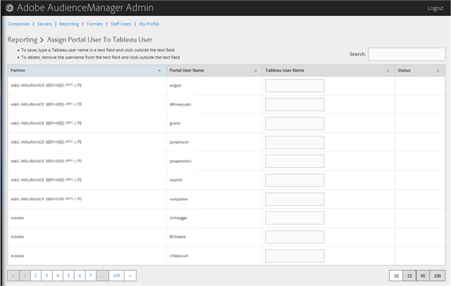

# ポータルユーザーを Tableau ユーザーに割り当てる {#assign-a-portal-user-to-tableau-user}

<!-- t_tabeau.xml -->

[!UICONTROL Reporting] ページを使用して、ポータルユーザーを [!DNL Tableau] ユーザーにします。これにより、ユーザーは Audience Manager で [!DNL Tableau] レポートを表示できます。

1. **[!UICONTROL Reporting]**／**[!UICONTROL Assign Portal User to Tableau User]** をクリックします。

   

1. ユーザーを割り当てるには、目的のパートナーの行で、テキストフィールドに [!DNL Tableau] ユーザー名を入力してから、テキストフィールドの外側をクリックします。

ユーザーの割り当てを削除するには、目的のパートナーの行で、テキストフィールドからユーザー名を削除し、その後テキストフィールドの外側をクリックします。
