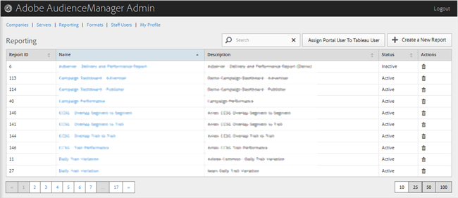

# レポート {#reporting}

新しいレポートを作成するか、既存のレポートを編集または削除することで、Audience Manager レポートを管理します。また、ポータルユーザーを [!DNL Tableau] ユーザーに割り当てることができます。

<!-- c_reporting.xml -->

目的の列のヘッダーをクリックすると、その列を昇順または降順に並べ替えることができます。

[!UICONTROL Search] ボックスまたはリストの下部にあるページネーションコントロールを使用して、目的のレポートを見つけます。
