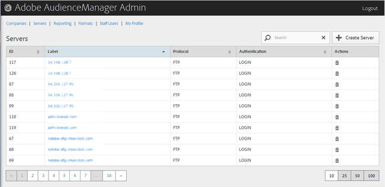

# サーバーの削除 {#delete-a-server}

Audience Manager の Admin ツールの [!UICONTROL Servers] ページを使用して、既存のサーバーを削除します。

<!-- t_delete_server.xml -->

>[!NOTE]
>
>既存のサーバーを削除するには、[!UICONTROL DEXADMIN] の役割が必要です。

1. 既存のサーバーを削除するには、「**[!UICONTROL Servers]**」をクリックします。

   

1. 「」列で **[!UICONTROL Actions]** をクリックします。
1. 「**[!UICONTROL OK]**」をクリックして削除を確定します。
