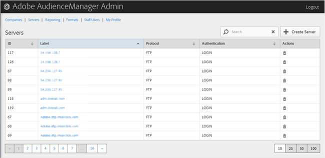

# サーバーの概要 {#servers-overview}

[!UICONTROL Servers] ページを使用して、Audience Manager 構成内のサーバーのリストを表示します。適切な役割が割り当てられているユーザーは、既存のサーバーの編集や削除、新しいサーバーの作成ができます。

<!-- c_servers.xml -->

目的の列のヘッダーをクリックすると、その列を昇順または降順に並べ替えることができます。「[!UICONTROL Search]」ボックス、またはリストの最下部にあるページネーションコントロールを使用して、目的のサーバーを検索します。