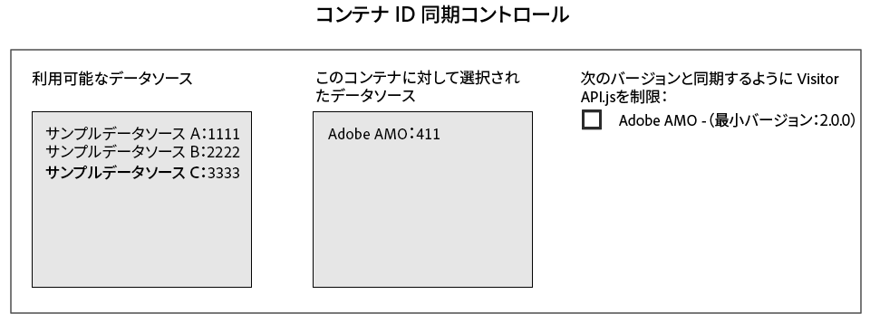

# Media Manager との ID 同期 {#id-syncing-with-media-optimizer}

デフォルトでは、すべての会社が[!DNL Adobe Media Optimizer]（[!DNL AMO]）とデータを同期します。[!UICONTROL Admin UI] では、各会社コンテナにこの処理を管理するデータソースがあります。このデータソースは [!UICONTROL Adobe AMO]（ [!UICONTROL ID] 411）です。選択した会社のコンテナ行（「[!UICONTROL Containers]」タブ内）をクリックすると、このデフォルトの同期の無効化や、[!DNL AMO] 同期処理のデータソースの追加や削除ができます。

## ID 同期ステータス {#id-sync-status}

次の表は、データソースの同期ステータスの一覧です。

| ステータス | 説明 |
|------ | -------- |
| オフ | このコンテナの [!UICONTROL Selected Data Sources] からすべてのデータソースを削除して、[!DNL AMO] との ID 同期を無効化します。 |
| オン（ID サービスバージョンと関係なく） | 以下に該当する場合、ID サービスバージョンと関係なく、データソースは [!DNL AMO] と同期します。 <ul><li>データソースが「[!UICONTROL Selected Data Sources]」リストに表示されている。</li><li>「[!DNL AMO]」チェックボックスがオンに&#x200B;*なっていない*。</li></ul> |
| オン（ID サービスバージョンと関係なく） | 以下に該当する場合、データソースは ID サービスのバージョンが 2.0 以降の [!DNL AMO] と同期します。 <ul><li>データソースが「[!UICONTROL Selected Data Sources]」リストに表示されている。</li><li>「[!DNL AMO]」チェックボックスがオンに&#x200B;*なっている*。</li></ul> |

>[!MORELIKETHIS]
>
>* [コンテナの管理](../companies/admin-manage-containers.md#task_61DB5CEECC5049DD8D059C642AC3F967)

