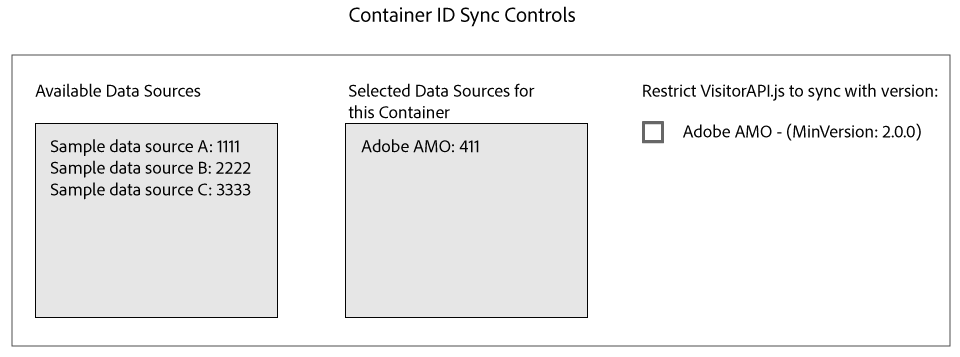

# Media Manager との ID 同期 {#id-syncing-with-media-optimizer}

デフォルトでは、すべての会社がデータを同期します（ [!DNL Adobe Media Optimizer][!DNL AMO]）。[!UICONTROL Admin UI] では、各会社コンテナにこの処理を管理するデータソースがあります。This data source is [!UICONTROL Adobe AMO] ([!UICONTROL ID] 411). 選択した会社のコンテナ行（「[!UICONTROL Containers][!DNL AMO]」タブ内）をクリックすると、このデフォルトの同期の無効化や、 同期処理のデータソースの追加や削除ができます。

## ID 同期ステータス {#id-sync-status}

次の表は、データソースの同期ステータスの一覧です。

| ステータス | 説明 |
|------ | -------- |
| オフ | Remove all the data sources from [!UICONTROL Selected Data Sources] for this container to disable ID syncs with [!DNL AMO] |
| オン（ID サービスバージョンと関係なく） | A data source syncs with [!DNL AMO] regardless of ID service version when: <ul><li>The data source appears in the [!UICONTROL Selected Data Sources] list.</li><li>[!DNL AMO] このチェックボックス *は* 選択されていません。</li></ul> |
| オン（ID サービスバージョンと関係なく） | A data source will sync with [!DNL AMO] with ID service version 2.0 (or greater) when: <ul><li>The data source appears in the [!UICONTROL Selected Data Sources] list.</li><li>[!DNL AMO] チェックボックス ** が選択されます。</li></ul> |

>[!MORE_LIKE_THIS]
>
>* [コンテナの管理](../companies/admin-manage-containers.md#task_61DB5CEECC5049DD8D059C642AC3F967)

