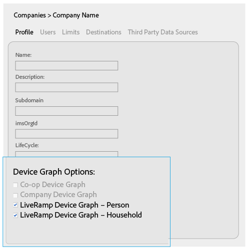
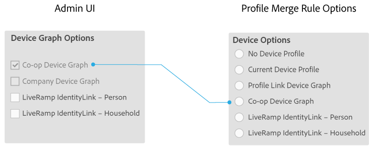
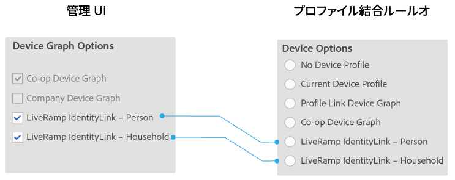

# 会社のデバイスグラフオプション {#device-graph-options-for-companies}

[!UICONTROL Device Graph Options] は、[!DNL Adobe Experience Cloud Device Co-op] に参加する会社が利用できます。顧客が Audience Manager と統合されているサードパーティのデバイスグラフのプロバイダーとも契約関係にある場合、このセクションにはそのデバイスグラフのオプションが表示されます。これらのオプションは、[!UICONTROL Companies]／会社名／[!UICONTROL Profile]／[!UICONTROL Device Graph Options] にあります。

この図では、サードパーティのデバイスグラフオプションの一般的な名前を使用しています。実際には、これらの名前はデバイスグラフのプロバイダーが決定するので、ここで示されているものとは異なる場合があります。例えば、[!DNL LiveRamp] オプションは通常（必ずではありません）次のようになります。

* 「[!DNL LiveRamp]」で始まる
* それぞれ異なるミドルネームが付く
* 「[!UICONTROL - Household]」または「[!UICONTROL -Person]」で終わる

## 定義されたデバイスグラフオプション {#device-graph-options-defined}

ここで選択する [!UICONTROL Device Options] により、[!DNL Audience Manager] の顧客が[!UICONTROL Profile Merge Rule] の作成時に使用できるデバイスオプションの表示と非表示が設定されます。

### Co-op Device Graph {#co-op-graph}

[Adobe Experience Cloud Device Co-opに参加するお客様は](https://marketing.adobe.com/resources/help/en_US/mcdc/) 、これらのオプションを使用して、決定論的データと確率 [!UICONTROL Profile Merge Rule] 的データ [を使用します](https://marketing.adobe.com/resources/help/en_US/mcdc/mcdc-links.html)。 [!DNL Corporate Provisioning Team] は、バックエンドの [!DNL API] 呼び出しを介してこのオプションをアクティブ化および非アクティブ化します。これらのボックスを [!DNL Admin UI] でオンまたはオフにすることはできません。また、「**[!UICONTROL Co-op Device Graph]**」オプションと「**[!UICONTROL Company Device Graph]**」オプションは相互に排他的です。顧客はいずれか一方のみをアクティブ化するよう要請することはできますが、両方をアクティブ化することはできません。このオプションを選択すると、**[!UICONTROL Co-op Device Graph]** コントロールが [!UICONTROL Profile Merge Rule] の [!UICONTROL Device Options] 設定に表示されます。

### Company Device Graph {#company-graph}

このオプションは、[!DNL Analytics] レポートスイートで「[!UICONTROL People]」指標を使用する [!DNL Analytics] ユーザー向けのものです。[!DNL Corporate Provisioning Team] は、バックエンドの [!DNL API] 呼び出しを介してこのオプションをアクティブ化および非アクティブ化します。これらのボックスを [!DNL Admin UI] でオンまたはオフにすることはできません。また、「**[!UICONTROL Company Device Graph]**」オプションと「**[!UICONTROL Co-op Device Graph]**」オプションは相互に排他的です。顧客はいずれか一方のみをアクティブ化するよう要請することはできますが、両方をアクティブ化することはできません。オンにすると、次のようになります。

* このデバイスグラフは、設定中の会社に属する決定的データ（確率的データではありません）を使用します。
* [!DNL Audience Manager] は、`*`パートナー名`*-Company Device Graph-Person`と呼ばれる [!UICONTROL Data Source] を自動的に作成します。[!UICONTROL Data Source] ユーザーは、「[!DNL Audience Manager]」詳細ページで、パートナー名や説明を変更したり、[データエクスポートコントロール](https://marketing.adobe.com/resources/help/en_US/aam/c_dec.html)をこのデータソースに適用することができます。
* [!DNL Audience Manager] のお客様の場合、[!UICONTROL Profile Merge Rule] の [!UICONTROL Device Options] セクションには新しい設定が表示&#x200B;*されません*。

### LiveRamp Device Graph（「Person」または「Household」） {#liveramp-device-graph}

これらのチェックボックスは、 パートナーが [!UICONTROL Data Source] を作成し、「**[!UICONTROL Use as an Authenticated Profile]**」および／あるいは「**[!UICONTROL Use as a Device Graph]**」を選択すると [!DNL Admin UI] で有効になります。これらの設定の名前は、サードパーティのデバイスグラフのプロバイダー（[!DNL LiveRamp] や [!DNL TapAd] など）によって異なります。オンにすると、設定中の会社はこれらのデバイスグラフにより提供されるデータを使用します。

>[!MORELIKETHIS]
>
>* [定義済みのプロファイルの結合ルールオプション](https://marketing.adobe.com/resources/help/en_US/aam/merge-rule-definitions.html)
>* [データソース設定とメニューオプション](https://marketing.adobe.com/resources/help/en_US/aam/datasource-settings-definitions.html)

