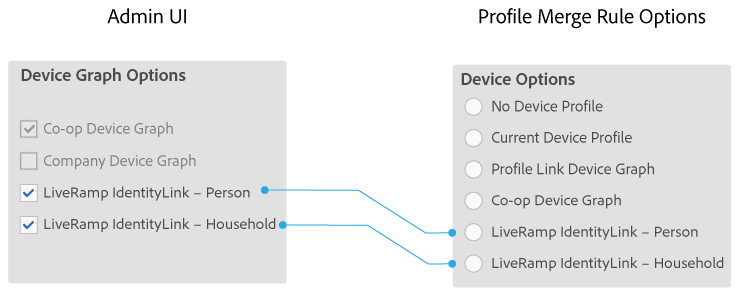

# 会社のデバイスグラフオプション {#device-graph-options-for-companies}

に参 [!UICONTROL Device Graph Options] 加する会社が利用できます [!DNL Adobe Experience Cloud Device Co-op]。 顧客が Audience Manager と統合されているサードパーティのデバイスグラフのプロバイダーとも契約関係にある場合、このセクションにはそのデバイスグラフのオプションが表示されます。これらのオプションは、/ [!UICONTROL Companies] 会社名//にあ [!UICONTROL Profile] ります [!UICONTROL Device Graph Options]。

この図では、サードパーティのデバイスグラフオプションの一般的な名前を使用しています。実際には、これらの名前はデバイスグラフのプロバイダーが決定するので、ここで示されているものとは異なる場合があります。For example, the [!DNL LiveRamp] options usually (but not always):

* 最初に "[!DNL LiveRamp]"
* それぞれ異なるミドルネームが付く。
* 「[!UICONTROL - Household]」または「[!UICONTROL -Person]」で終わる

## 定義されたデバイスグラフオプション {#device-graph-options-defined}

The device graph options you select here expose or hide the [!UICONTROL Device Options] choices available to an [!DNL Audience Manager] customer when they create a [!UICONTROL Profile Merge Rule].

### Co-op Device Graph {#co-op-graph}

[Adobe Experience Cloud Device Co-opに参加するお客様は](https://marketing.adobe.com/resources/help/en_US/mcdc/) 、これらのオプションを使用して、決定論的データと確率 [!UICONTROL Profile Merge Rule] 的データ [を使用します](https://marketing.adobe.com/resources/help/en_US/mcdc/mcdc-links.html)。 このオ [!DNL Corporate Provisioning Team] プションは、バックエンド呼び出しを使用してアクティブ化または非アクティブ [!DNL API] 化します。 You cannot check or clear these boxes in the [!DNL Admin UI]. Also, the **[!UICONTROL Co-op Device Graph]** and **[!UICONTROL Company Device Graph]** options are mutually exclusive. 顧客はいずれか一方のみをアクティブ化するよう要請することはできますが、両方をアクティブ化することはできません。オンにすると、コントロー **[!UICONTROL Co-op Device Graph]** ルがの設定に [!UICONTROL Device Options] 表示されま [!UICONTROL Profile Merge Rule]す。

### Company Device Graph {#company-graph}

This option is for [!DNL Analytics] customers who use the [!UICONTROL People] metric in their [!DNL Analytics] report suite. このオ [!DNL Corporate Provisioning Team] プションは、バックエンド呼び出しを使用してアクティブ化または非アクティブ [!DNL API] 化します。 You cannot check or clear these boxes in the [!DNL Admin UI]. Also, the **[!UICONTROL Company Device Graph]** and **[!UICONTROL Co-op Device Graph]** options are mutually exclusive. 顧客はいずれか一方のみをアクティブ化するよう要請することはできますが、両方をアクティブ化することはできません。オンにすると、次のようになります。

* このデバイスグラフは、設定中の会社に属する決定的データ（確率的データではありません）を使用します。
* [!DNL Audience Manager] は、自動的に呼び出され [!UICONTROL Data Source] たパートナー `*`名を作成しま`*-Company Device Graph-Person`す。 [!UICONTROL Data Source] ユーザーは、「[!DNL Audience Manager]」詳細ページで、パートナー名や説明を変更したり、[データエクスポートコントロール](https://marketing.adobe.com/resources/help/en_US/aam/c_dec.html)をこのデータソースに適用することができます。
* [!DNL Audience Manager] 顧客 *に対して* 、のセクションに新しい設定が [!UICONTROL Device Options] 表示されませ [!UICONTROL Profile Merge Rule]ん。

### LiveRamp Device Graph (Person or Household) {#liveramp-device-graph}

これらのチェックボックスは、パートナーが [!DNL Admin UI] を作成し、選択または [!UICONTROL Data Source] またはその両方を **[!UICONTROL Use as an Authenticated Profile]** 行うときに有効になりま **[!UICONTROL Use as a Device Graph]**&#x200B;す。 The names for these settings are determined by the third-party device graph provider (e.g., [!DNL LiveRamp], [!DNL TapAd], etc.). オンにすると、設定中の会社はこれらのデバイスグラフにより提供されるデータを使用します。

>[!MORE_LIKE_THIS]
>
>* [定義済みのプロファイルの結合ルールオプション](https://marketing.adobe.com/resources/help/en_US/aam/merge-rule-definitions.html)
>* [データソース設定とメニューオプション](https://marketing.adobe.com/resources/help/en_US/aam/datasource-settings-definitions.html)

