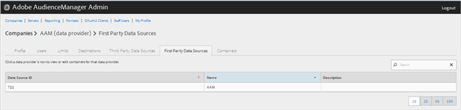
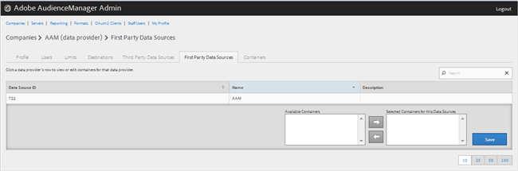

# ファーストパーティデータプロバイダーの管理 {#manage-first-party-data-providers}

ファーストパーティデータプロバイダーのコンテナとマッピングを表示または編集します。

<!-- t_first_party_providers.xml -->

1. **[!UICONTROL Companies]**&#x200B;をクリックし、目的の会社を検索してからクリックして、[!UICONTROL Profile] ページを表示します。「[!UICONTROL Search]」ボックス、またはリストの最下部にあるページネーションコントロールを使用して、目的の会社を検索します。目的の列のヘッダーをクリックすると、その列を昇順または降順に並べ替えることができます。

1. 「**[!UICONTROL First Party Data Providers]**」タブをクリックします。

   

1. データプロバイダーの行をクリックして、そのデータプロバイダーのコンテナとマッピングを表示または編集します。

   

1. 目的のコンテナを選択し、必要に応じて左右の矢印をクリックして、「**[!UICONTROL Available Containers]**」および「**[!UICONTROL Selected Containers for This Data Provider]**」リストからコンテナを移動します。
1. 変更した場合は&#x200B;**[!UICONTROL Save]**&#x200B;をクリックします。
