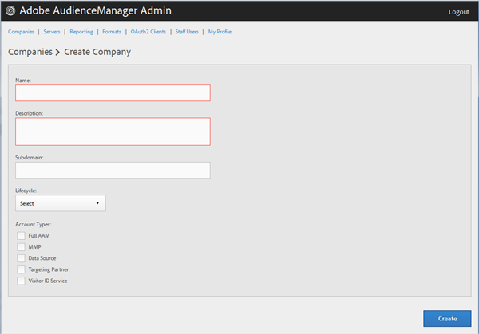

# 会社プロファイルの作成 {#create-a-company-profile}

Audience Manager の Admin ツールの [!UICONTROL Companies] ページを使用して、新しい会社を作成します。

<!-- t_create_company.xml -->

>[!NOTE]
>
>新しい会社を作成するには、**[!UICONTROL DEXADMIN]** の役割が必要です。

1. **[!UICONTROL Companies]**／**[!UICONTROL Add Company]** をクリックします。
1. 以下のフィールドを設定します。

   * **[!UICONTROL Name]**：（必須）会社の名前を表します。
   * **[!UICONTROL Description]**：（必須）業種や完全名など、会社の説明情報を入力します。
   * **[!UICONTROL Subdomain]**：（必須）会社のサブドメインを表します。入力するテキストは、イベント呼び出しのサブドメインとして表示されます。これは変更できません。[!DNL URL] に有効な文字による文字列でなければなりません。

      例えば、会社の名前が [!DNL AcmeCorp] の場合、サブドメインは [!DNL acmecorp] となります。

      Audience Manager では、[!UICONTROL Data Collection Server]（DCS）のサブドメインを使用します。前述の例では、[!UICONTROL DCS] での会社の完全な [!DNL URL] は [!DNL acmecorp.demdex.net] となります。

   * **[!UICONTROL Lifecyle]**：会社の目的のステージを表します。
      * **[!UICONTROL Active]**：会社がアクティブな Audience Manager クライアントであることを表します。[!UICONTROL Active] アカウントとは、コンサルティングだけでなく、Audience Manager SKU についても取引がある顧客を表します。
      * **[!UICONTROL Demo]**：会社がデモ目的のみであることを表します。架空のレポートデータが自動的に作成されます。
      * **[!UICONTROL Prospect]**：会社が Audience Manager の見込み顧客であることを表します。例えば、無償の [!DNL POC] を付与される会社や、販売デモのアカウント設定などが該当します。
      * **[!UICONTROL Test]**：会社が内部テスト専用であることを表します。
   * **[!UICONTROL Account Types]**：この会社のすべてのアカウントタイプを表します。どのアカウントタイプも、他のタイプと相互に排他的ではありません。
      * **[!UICONTROL Full AAM]**：会社が完全な Adobe Audience Manager アカウントを保有し、ユーザーにログインアクセス権が付与されることを表します。
      * **[!UICONTROL MMP]**：[!UICONTROL Master Marketing Profile]（[!UICONTROL MMP]機能を会社が使用できる状態であることを表します。[!UICONTROL MMP] を使用すると、すべての訪問者に割り当てられ、Audience Manager で使用される一意の [!UICONTROL Experience Cloud ID]（[!DNL MCID]）を使用して Experience Cloud 全体でオーディエンスを共有できます。このアカウントタイプを選択すると、[!UICONTROL Experience Cloud ID Service] も自動的に選択されます。

         詳しくは、[オーディエンスサービス - マスターマーケティングプロファイル](https://marketing.adobe.com/resources/help/ja_JP/mcloud/audience_library.html)を参照してください。
   * **[!UICONTROL Data Source]**：会社が Audience Manager 内のサードパーティのデータプロバイダーであることを表します。
   * **[!UICONTROL Targeting Partner]**：会社が Audience Manager ユーザーのターゲティングプラットフォームとして機能することを表します。
   * **[!UICONTROL Visitor ID Service]**：会社が [!UICONTROL Experience Cloud Visitor ID Service] の使用を有効にしていることを表します。

      [!UICONTROL Experience Cloud Visitor ID Service] は、Experience Cloud ソリューションをまたいだユニバーサル訪問者 ID を提供します。詳細については、『[Experience Cloud 訪問者 ID サービスユーザーガイド](https://marketing.adobe.com/resources/help/ja_JP/mcvid/mcvid-overview.html)』を参照してください。

   * **[!UICONTROL Agency]**：会社が [!UICONTROL Agency] アカウントを保有することを表します。

1. 「**[!UICONTROL Create]**」をクリックします。「[会社プロファイルの編集](../companies/admin-manage-company-profiles.md#edit-company-profile)」の手順を続行します。

   

## 会社プロファイルの編集 {#edit-company-profile}

会社の名前、説明、サブドメイン、ライフサイクルなどのプロファイルを編集します。

<!-- t_edit_company_profile.xml -->

1. **[!UICONTROL Companies]**&#x200B;をクリックし、目的の会社を検索してからクリックして、[!UICONTROL Profile] ページを表示します。

   「[!UICONTROL Search]」ボックス、またはリストの最下部にあるページネーションコントロールを使用して、目的の会社を検索します。目的の列のヘッダーをクリックすると、その列を昇順または降順に並べ替えることができます。

   

1. 必要に応じてフィールドを編集します。

   * **[!UICONTROL Name]**：会社の名前を編集します。これは必須フィールドです。
   * **[!UICONTROL Description]**：会社の説明を編集します。これは必須フィールドです。
   * **[!UICONTROL Subdomain]**：（必須）会社のサブドメインを表します。入力するテキストは、イベント呼び出しのサブドメインとして表示されます。これは変更できません。[!DNL URL] に有効な文字による文字列でなければなりません。

      例えば、会社の名前が [!DNL AcmeCorp] の場合、サブドメインは [!DNL acmecorp] となります。

      Audience Manager では、[!UICONTROL Data Collection Server]（DCS）のサブドメインを使用します。前述の例では、[!UICONTROL DCS] での会社の完全な [!DNL URL] は [!DNL acmecorp.demdex.net] となります。

   * **[!UICONTROL imsOrgld]**：（[!UICONTROL Identity Management System Organization ID]）この ID を使用すると、会社を Adobe Experience Cloud と接続できます。
   * **[!UICONTROL Lifecyle]**：会社の目的のステージを表します。
      * **[!UICONTROL Active]**：会社がアクティブな Audience Manager クライアントであることを表します。アクティブなアカウントとは、コンサルティングだけでなく、Audience Manager SKU についても取引がある顧客を指します。
      * **[!UICONTROL Demo]**：会社がデモ目的のみであることを表します。架空のレポートデータが自動的に作成されます。
      * **[!UICONTROL Prospect]**：会社が Audience Manager の見込み顧客であることを表します。例えば、無償の [!DNL POC] を付与される会社や、販売デモのアカウント設定などが該当します。
      * **[!UICONTROL Test]**：会社が内部テスト専用であることを表します。
   * **[!UICONTROL Account Types]**：この会社のすべてのアカウントタイプを表します。どのアカウントタイプも、他のタイプと相互に排他的ではありません。
      * **[!UICONTROL Full AAM]**：会社が完全な Adobe Audience Manager アカウントを保有し、ユーザーにログインアクセス権が付与されることを表します。
      * **[!UICONTROL MMP]**：マスターマーケティングプロファイル（[!UICONTROL MMP]）機能を会社が使用できる状態であることを表します。

         このアカウントタイプを選択すると、**[!UICONTROL Visitor ID Service]** も自動的に選択されます。詳しくは、[オーディエンスサービス - マスターマーケティングプロファイル](https://marketing.adobe.com/resources/help/ja_JP/mcloud/audience_library.html)を参照してください。
   * **[!UICONTROL Data Source]**：会社が Audience Manager 内のサードパーティのデータプロバイダーであることを表します。
   * **[!UICONTROL Targeting Partner]**：会社が Audience Manager ユーザーのターゲティングプラットフォームとして機能することを表します。
   * **[!UICONTROL Visitor ID Service]**：会社が Experience Cloud 訪問者 ID サービスを使用できる状態であることを表します。

      Experience Cloud 訪問者 ID サービスは、Experience Cloud ソリューション全体に汎用の訪問者 ID を提供します。詳しくは、[Experience Cloud 訪問者 ID サービスユーザーガイド](https://microsite.omniture.com/t2/help/ja_JP/mcvid/mcvid_service.html)を参照してください。

   * **[!UICONTROL Agency]**：会社がエージェンシーアカウントを保有することを表します。
   * **[!UICONTROL Features]**：目的のオプションを選択します。
      * **[!UICONTROL Password Expiration]**：この会社内のすべてのユーザーパスワードが 90 日後に期限切れになるよう設定し、Audience Manager のセキュリティを強化します。
      * **[!UICONTROL Reporting]**：この会社での Audience Manager レポートを有効にします。
      * **[!UICONTROL Role Based Access Controls]**：この会社の役割ベースのアクセス制御を有効にします。役割ベースのアクセス制御により、アクセス権がそれぞれ異なるユーザーグループを作成できます。これらのグループ内の個々のユーザーは、Audience Manager の特定の機能にしかアクセスできません。

1. 「**[!UICONTROL Submit Updates]**」をクリックします。

## 会社プロファイルの削除 {#delete-company-profile}

Audience Manager の [!UICONTROL Admin] ツールの [!UICONTROL Companies] ページを使用して、既存の会社を削除します。

<!-- t_delete_company.xml -->

>[!NOTE]
>
>既存の会社を削除するには、[!UICONTROL DEXADMIN] の役割が必要です。

1. 既存の会社を削除するには、「**[!UICONTROL Companies]**」をクリックします。

   

1. 目的の会社の「」列で **[!UICONTROL Actions]** をクリックします。
1. 「**[!UICONTROL OK]**」をクリックして削除を確定します。
