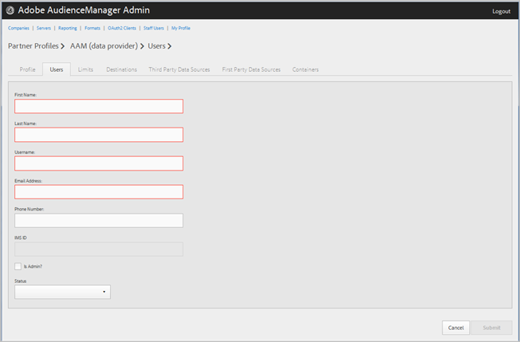

# 会社ユーザーの管理 {#manage-company-users}

Audience Manager の新規宛先を作成するか、既存の宛先を編集または削除します。

<!-- t_manage_company_users.xml -->

1. 「**[!UICONTROL Companies]**」をクリックし、目的の会社を検索してからクリックして、[!UICONTROL Profile] ページを表示します。

   「[!UICONTROL Search]」ボックス、またはリストの最下部にあるページネーションコントロールを使用して、目的の会社を検索します。目的の列のヘッダーをクリックすると、その列を昇順または降順に並べ替えることができます。
1. 「**[!UICONTROL Users]**」タブをクリックします。
1. 新しいユーザーを作成するには、「**[!UICONTROL Create a New User]**」をクリックします。既存のユーザーを編集するには、「**[!UICONTROL Username]**」列で目的のユーザーを特定してクリックします。

   

1. 以下のフィールドを設定します。

   * **[!UICONTROL First Name]**：（必須）ユーザーの名を指定します。
   * **[!UICONTROL Last Name]**：（必須）ユーザーの姓を指定します。
   * **[!UICONTROL Username]**：（必須）ユーザーの Audience Manager ユーザー名を指定します。ユーザー名は一意でなければなりません。
   * **[!UICONTROL Email Address]**：（必須）ユーザーの電子メールアドレスを指定します。
   * **[!UICONTROL Phone Number]**：ユーザーの電話番号を指定します。
   * **[!UICONTROL IMS ID]**：ユーザーの [!UICONTROL Identity Management System ID]。この ID により、ユーザーはアドビのソリューションを Adobe Experience Cloud にリンクすることができます。
   * **[!UICONTROL Is Admin]**：このユーザーを Audience Manager 管理ユーザーにします。管理者はこのパートナーに対して Audience Manager のすべてのユーザー役割を持っています。
   * **[!UICONTROL Status]**：新しいユーザーの作成時、このフィールドには最初に「**[!UICONTROL Pending]**」と表示されます。この状態は、ユーザーがログインして臨時パスワードをリセットするまで続きます。既存のユーザーを編集する場合、次のいずれかのステータスを選択できます。
      * **[!UICONTROL Active]**：このユーザーがアクティブな Audience Manager ユーザーであることを表します。
      * **[!UICONTROL Deactivated]**：このユーザーが非アクティブな Audience Manager ユーザーであることを表します。
      * **[!UICONTROL Expired]**：このユーザーが有効期限切れであることを表します。
      * **[!UICONTROL Locked Out]**：このユーザーがロックアウトされていることを表します。

1. 「**[!UICONTROL Submit]**」をクリックします。

## ユーザーの削除 {#delete-user}

ユーザーを削除するには：

1. 「**[!UICONTROL Companies]**」をクリックし、目的の会社を特定してからクリックして、その後「**[!UICONTROL Users]**」タブをクリックします。
1. 目的のユーザーの「」列で **[!UICONTROL Actions]** をクリックします。
1. 「**[!UICONTROL OK]**」をクリックして削除を確定します。