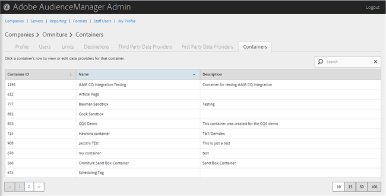
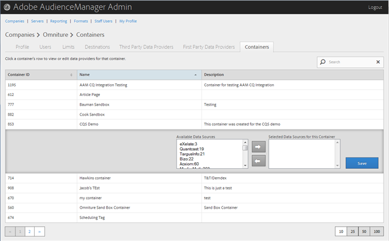

# コンテナの管理 {#manage-containers}

コンテナのデータプロバイダーを表示または編集します。

<!-- t_containers.xml -->

>[!NOTE]
>
>デフォルトでは、会社は1つのコンテナで作成されます。 You can create further containers for a company in the user interface, in **[!UICONTROL Manage Data > Tags]**.

1. 「**[!UICONTROL Companies]**」をクリックし、目的の会社を検索してからクリックして、[!UICONTROL Profile] ページを表示します。

   「[!UICONTROL Search]」ボックス、またはリストの最下部にあるページネーションコントロールを使用して、目的の会社を検索します。目的の列のヘッダーをクリックすると、その列を昇順または降順に並べ替えることができます。

1. 「**[!UICONTROL Containers]**」タブをクリックします。

   

1. コンテナの行をクリックすると、そのコンテナのデータプロパティを表示または編集します。

   

1. Move data sources from the **[!UICONTROL Available Data Sources]** and **[!UICONTROL Selected Data Sources for This Container]** lists by selecting the desired data sources, then clicking the right or left arrows as necessary.

   このタスクは、サードパーティデータプロバイダ [ーページからも実行で](../companies/admin-third-party-providers.md#task_E942DD674D794BA6B8EFD52FD866E689)きます。

1. Click **[!UICONTROL Save]** if you made changes.

>[!MORE_LIKE_THIS]
>
>* [Media Manager との ID 同期](../companies/admin-amo-sync.md#concept_2B5537233DAA4860B3503B344F937D83)

