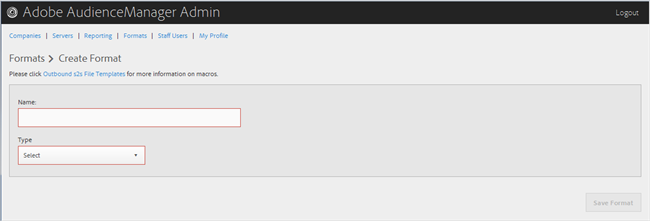

# 形式の作成または編集 {#create-or-edit-a-format}

Audience Manager の Admin ツールの [!UICONTROL Formats] ページを使用して、新しい形式を作成するか、既存の形式を編集します。

<!-- t_create_format.xml -->

>[!TIP]
>
>送信データの形式を選択する場合は、できれば既存の形式を再利用するのが最善です。実績のある形式を使用すると、発信データを正常に生成できます。既存の形式がどのようにフォーマットされているかを正確に確認するには、メニューバーの「[!UICONTROL Formats]」オプションをクリックして、名前または ID 番号を使用して形式を検索します。形式、または形式で使用されているマクロが正しく設定されていない場合、出力が正しくフォーマットされなくなるか、情報が完全には出力されなくなります。

1. 新しい形式を作成するには、**[!UICONTROL Formats]**／**[!UICONTROL Add Format]** の順にクリックします。既存の形式を編集するには、「**[!UICONTROL Name]**」列で目的の形式をクリックします。

   

1. 以下のフィールドを設定します。
   * **Name：**（必須）形式のわかりやすい名前を指定します。
   * **Type：**（必須）目的の形式を選択します。
      * **[!UICONTROL File]**：データを [!DNL FTP] ファイルで送信します。
      * **[!UICONTROL HTTP]**：データを [!DNL JSON] ラッパーで囲みます。

1. （オプション）「**[!UICONTROL File]**」を選択した場合は、次の各フィールドに入力します。

   >[!NOTE]
   >
   >使用可能なマクロのリストについては [ファイル形式マクロ](../formats/file-formats.md#concept_A867101505074418A58DE325949E5089)および [HTTP 形式マクロ](../formats/web-formats.md#reference_C392124A5F3F42E49F8AADDBA601ADFE)を参照してください。

   * **[!UICONTROL File Name]：**&#x200B;データ転送ファイルのファイル名を指定します。
   * **Header：**&#x200B;データ転送ファイルの 1 行目に表示されるテキストを指定します。
   * **[!UICONTROL Data Row]：**&#x200B;ファイルのそれ以降の各行に表示されるテキストを指定します。
   * **[!UICONTROL Maximum File Size (In MB)]：**&#x200B;データ転送ファイルの最大ファイルサイズを指定します。圧縮ファイルは 100 MB 未満でなければなりません。未圧縮ファイルのサイズ制限はありません。
   * **[!UICONTROL Compression]：**&#x200B;データファイルの圧縮タイプ（gz または zip）を選択します。[!UICONTROL AWS S3] への配信には、.gz または未圧縮ファイルを使用する必要があります。
   * **[!UICONTROL .info Receipt]：**&#x200B;転送制御ファイル（[!DNL .info]）ファイルが生成されます。[!DNL .info] ファイルには、ファイル転送についてのメタデータが格納されます。これにより、パートナーは Audience Manager がファイル転送を正しく処理したことを確認できます。詳しくは、[ログファイル転送の転送制御ファイル](https://marketing.adobe.com/resources/help/ja_JP/aam/c_s2s_add_transfer_control_files.html)を参照してください。
   * **[!UICONTROL MD5 Checksum Receipt]：**[!DNL MD5] チェックサムレシートが生成されることを指定します。[!DNL MD5] チェックサムレシートにより、パートナーは Audience Manager が完全転送を正しく処理したことを確認できます。

1. （オプション）「**[!UICONTROL HTTP]**」を選択した場合は、次の各フィールドに入力します。

   * **[!UICONTROL Method]：**&#x200B;転送プロセスで使用する [!DNL API] メソッドを選択します。
      * **[!UICONTROL POST]：**[!DNL POST] を選択した場合、コンテンツタイプ（[!DNL XML] または [!DNL JSON]）を選択してから、リクエスト本文を指定します。
      * **[!UICONTROL GET]：**[!DNL GET] を選択した場合は、クエリパラメーターを指定します。

1. 新しい形式を作成する場合は「**[!UICONTROL Create]**」をクリックし、既存の形式を編集する場合は「**[!UICONTROL Save Updates]**」をクリックします。

## 形式の削除 {#delete-format}

1. 「**[!UICONTROL Formats]**」をクリックします。
2. 目的の形式の「」列で **[!UICONTROL Actions]** をクリックします。
3. 「**[!UICONTROL OK]**」をクリックして削除を確定します。
