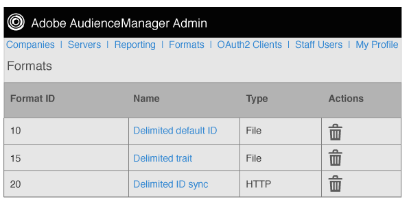

# フォーマットの概要 {#formats-overview}

形式とは、宛先に送信されるデータの内容を整理するためにマクロを使用している、保存されたテンプレート（またはファイル）です。Format types include [!DNL HTTP] formats and file formats. [!DNL HTTP] formatは、またはメソッドを使用して [!DNL JSON] オブジェクト内のデータ [!DNL POST] を送信 [!DNL GET] します。File formats send data in a file by [!DNL FTP]. 各形式で使用するマクロでは、ファイル名の設定、ファイルヘッダーの定義、データファイルの内容の整理ができます。In the Admin [!DNL UI], you can create, save, and re-use formats when setting up destinations for customers.

